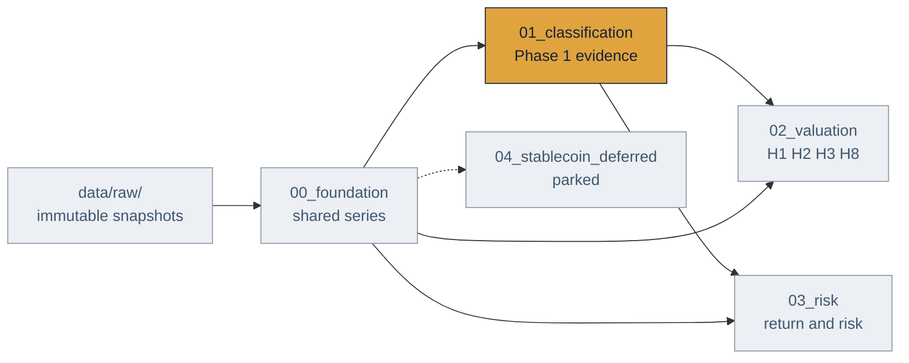

# Data map

Generated by `python -m src.pipeline.data_map --repo .`. Every processed file, which phase it belongs to, which module writes it and which modules read it. Do not edit by hand.

**152 processed files.** Foundation: 24 · Phase 1 — Economic classification: 53 · Phase 2 — Valuation tests: 24 · Phase 3 — Risk and market structure: 7 · Phase 4 — Stablecoin risk (deferred): 44

## How data flows

## Foundation

Shared market, price and activity series that more than one phase consumes.

`data/processed/00_foundation/`

| File | Written by | Read by |
|---|---|---|
| `binance_pair_audit.csv` | `binance_klines` | `source_availability` |
| `bnb_monetary_activity_dune.csv` | `bnb_monetary_activity` | `crypto_monetary` |
| `coinpaprika_identifier_audit.csv` | `coinpaprika_market` | `source_availability` |
| `coverage_summary.json` | `registry` | terminal output |
| `crypto_fee_fundamentals_coverage.csv` | `crypto_fee_fundamentals`, `crypto_h2_expansion_readiness` | terminal output |
| `crypto_fee_fundamentals_daily.csv` | `crypto_fee_fundamentals`, `crypto_h2_pilot_panel` | via `crypto_phase1_research_map.json` |
| `crypto_fee_fundamentals_summary.json` | `crypto_fee_fundamentals` | `checkpoint_readiness` |
| `crypto_fundamentals_coverage_coinmetrics.csv` | `crypto_fundamentals` | terminal output |
| `crypto_fundamentals_daily_coinmetrics.csv` | `crypto_fundamentals` | `crypto_collateral`, `crypto_h2_pilot_panel`, `crypto_h3_supply_pilot`, `crypto_monetary` · via `crypto_phase1_research_map.json` |
| `crypto_fundamentals_summary.json` | `crypto_fundamentals` | `checkpoint_readiness` |
| `crypto_h4_aave_legacy_stake_daily.csv` | `crypto_h4_aave_legacy_stake` | terminal output |
| `crypto_h4_bnb_stake_daily.csv` | `crypto_h4_bnb_stake` | via `crypto_phase1_research_map.json` |
| `data_map.json` | — | via `pipeline_stages.json` |
| `identifier_registry.csv` | `registry` | terminal output |
| `market_coverage.csv` | `coinpaprika_market`, `crypto_h2_expansion_readiness`, `historical` | terminal output |
| `market_coverage_coinpaprika.csv` | `coinpaprika_market` | `crypto_h2_expansion_readiness` |
| `market_daily.csv` | `coinpaprika_market`, `crypto_collateral`, `historical`, `stablecoin_adoption`, `stablecoin_global_market`, `stablecoin_trading_activity` | `preregistration` |
| `market_daily_coinpaprika.csv` | `coinpaprika_market` | `crypto_collateral`, `crypto_h2_pilot_panel`, `crypto_h4_readiness`, `stablecoin_trading_activity` |
| `ohlcv_coverage_binance_spot.csv` | `binance_klines` | terminal output |
| `ohlcv_daily_binance_spot.csv` | `binance_klines` | via `crypto_return_panel.json` |
| `price_coverage_defillama.csv` | `llama_history` | terminal output |
| `price_daily_defillama.csv` | `llama_history` | `stablecoin_panel` |
| `snapshot_coverage.csv` | `registry` | terminal output |
| `source_availability.csv` | `source_availability` | via `pipeline_stages.json` |

## Phase 1 — Economic classification

Evidence, mechanism states, review reconciliation and the ten-function taxonomy.

`data/processed/01_classification/`

| File | Written by | Read by |
|---|---|---|
| `aave_collateral_state_daily.csv` | `aave_collateral_state` | terminal output |
| `aave_collateral_state_summary.csv` | `aave_collateral_state` | terminal output |
| `aave_collateral_state_summary.json` | `aave_collateral_state` | `checkpoint_readiness` |
| `bnb_monetary_activity_summary.json` | `bnb_monetary_activity` | terminal output |
| `classification_status.json` | `classification_status`, `crypto_collateral`, `crypto_economic_design`, `crypto_function_risk_exposure`, `crypto_phase1_bundle_comparison`, `crypto_phase1_taxonomy`, `research_universe_workbook` | via `pipeline_stages.json` |
| `crypto_collateral_daily_proxy.csv` | `crypto_collateral` | `venus_bnb_collateral_state` · via `crypto_phase1_research_map.json` |
| `crypto_collateral_protocol_detail.csv` | `crypto_collateral` | via `crypto_phase1_research_map.json` |
| `crypto_collateral_screen_summary.csv` | `crypto_collateral` | via `crypto_phase1_research_map.json` |
| `crypto_collateral_screen_summary.json` | `crypto_collateral` | `checkpoint_readiness` |
| `crypto_design_evidence_focused_review.csv` | `crypto_design_evidence` | terminal output |
| `crypto_design_evidence_tranche_1.csv` | `classification_status`, `crypto_design_evidence`, `research_universe_workbook` | `checkpoint_readiness`, `crypto_evidence_blockers` |
| `crypto_design_evidence_tranche_1_summary.json` | `crypto_design_evidence` | `checkpoint_readiness` |
| `crypto_economic_design_profiles.csv` | `crypto_economic_design` | terminal output |
| `crypto_economic_design_summary.json` | `crypto_economic_design` | terminal output |
| `crypto_economic_design_targeted_review.csv` | `crypto_economic_design` | terminal output |
| `crypto_evidence_blockers_summary.json` | `crypto_evidence_blockers` | `checkpoint_readiness` |
| `crypto_evidence_tranche_a.csv` | `classification_status`, `crypto_evidence_tranche_a`, `research_universe_workbook` | via `pipeline_stages.json` |
| `crypto_evidence_tranche_a_blind_review.csv` | `crypto_evidence_tranche_a` | terminal output |
| `crypto_evidence_tranche_a_summary.json` | `crypto_evidence_tranche_a` | terminal output |
| `crypto_h2_expansion_blind_review.csv` | `crypto_h2_expansion_evidence` | `classification_status`, `research_universe_workbook`, `review_adjudication` |
| `crypto_h2_expansion_evidence_audit.csv` | `crypto_h2_expansion_evidence` | terminal output |
| `crypto_h2_expansion_evidence_summary.json` | `crypto_h2_expansion_evidence` | `checkpoint_readiness` |
| `crypto_h2_expansion_readiness.csv` | `crypto_h2_expansion_readiness` | via `pipeline_stages.json` |
| `crypto_h2_expansion_readiness.json` | `crypto_h2_expansion_readiness` | `checkpoint_readiness` · via `pipeline_stages.json` |
| `crypto_h2_expansion_review_audit.csv` | `review_adjudication` | terminal output |
| `crypto_h2_h8_pilot_readiness.csv` | `crypto_h2_h8_readiness` | `crypto_h8_breadth_pilot`, `crypto_h8_six_asset_extension` |
| `crypto_h2_h8_pilot_readiness.json` | `crypto_h2_h8_readiness` | `checkpoint_readiness`, `crypto_findings_summary` |
| `crypto_h4_aave_legacy_stake_summary.json` | `crypto_h4_aave_legacy_stake` | `checkpoint_readiness`, `crypto_h4_readiness` |
| `crypto_h4_bnb_stake_summary.json` | `crypto_h4_bnb_stake` | `checkpoint_readiness`, `crypto_h4_readiness` |
| `crypto_h4_eth_stake_summary.json` | `crypto_h4_eth_stake`, `crypto_h4_readiness` | `checkpoint_readiness` |
| `crypto_h4_source_readiness.csv` | `crypto_h4_readiness` | terminal output |
| `crypto_h4_source_readiness.json` | `crypto_h4_readiness` | `checkpoint_readiness`, `crypto_findings_summary` · via `crypto_phase1_research_map.json` |
| `crypto_h8_evidence_audit.csv` | `crypto_h8_evidence_plan` | terminal output |
| `crypto_h8_evidence_plan_summary.json` | `crypto_h8_evidence_plan` | `checkpoint_readiness` |
| `crypto_h8_evidence_review.csv` | `crypto_h8_evidence_plan` | terminal output |
| `crypto_mechanism_state_asof.csv` | `crypto_mechanism_state` | terminal output |
| `crypto_mechanism_state_summary.json` | `crypto_mechanism_state` | `checkpoint_readiness` |
| `crypto_monetary_assessment.csv` | `crypto_monetary` | terminal output |
| `crypto_monetary_assessment.json` | `crypto_monetary` | `checkpoint_readiness` |
| `crypto_phase1_consistency_audit.csv` | `crypto_phase1_taxonomy` | terminal output |
| `crypto_phase1_experiment_registry.json` | `crypto_phase1_taxonomy` | `crypto_phase1_research_map` |
| `crypto_phase1_function_codebook.csv` | `crypto_phase1_taxonomy` | `crypto_phase1_research_map`, `research_universe_workbook` |
| `crypto_phase1_function_prevalence.csv` | `crypto_phase1_taxonomy` | `crypto_phase1_research_map` |
| `crypto_phase1_indicator_observability.csv` | `crypto_phase1_research_map` | terminal output |
| `crypto_phase1_research_map.csv` | `crypto_phase1_research_map` | via `pipeline_stages.json` |
| `crypto_phase1_research_map.json` | `crypto_phase1_research_map` | via `pipeline_stages.json` |
| `crypto_phase1_taxonomy_profiles.csv` | `crypto_phase1_research_map`, `crypto_phase1_taxonomy` | `research_universe_workbook` · via `crypto_function_risk_exposure.json`, `crypto_phase1_bundle_comparison.json`, `crypto_return_factor_baseline.json` |
| `crypto_phase1_taxonomy_summary.json` | `crypto_phase1_taxonomy` | `checkpoint_readiness` |
| `crypto_research_scope.json` | `crypto_research_scope` | `checkpoint_readiness`, `crypto_findings_summary` · via `pipeline_stages.json` |
| `independent_review_summary.json` | `review_adjudication` | `checkpoint_readiness`, `classification_status`, `crypto_findings_summary`, `research_universe_workbook` |
| `point_in_time_design_checkpoint.json` | `checkpoint_readiness` | terminal output |
| `venus_bnb_collateral_state_daily.csv` | `venus_bnb_collateral_state` | terminal output |
| `venus_bnb_collateral_state_summary.json` | `venus_bnb_collateral_state` | terminal output |

## Phase 2 — Valuation tests

H1 usage, H2 fee-and-capture, H3 supply, H8 breadth, and the mechanism event studies.

`data/processed/02_valuation/`

| File | Written by | Read by |
|---|---|---|
| `crypto_findings_summary.json` | `crypto_findings_summary` | via `pipeline_stages.json` |
| `crypto_h1_activity_pilot.csv` | `crypto_h1_activity_pilot` | via `pipeline_stages.json` |
| `crypto_h1_activity_pilot.json` | `crypto_h1_activity_pilot` | `checkpoint_readiness`, `crypto_findings_summary` · via `crypto_phase1_research_map.json`, `pipeline_stages.json` |
| `crypto_h2_estimator_diagnostics.csv` | `crypto_h2_estimator_diagnostics` | via `pipeline_stages.json` |
| `crypto_h2_estimator_diagnostics.json` | `crypto_h2_estimator_diagnostics` | `checkpoint_readiness` · via `pipeline_stages.json` |
| `crypto_h2_exploratory_daily.csv` | `crypto_h1_activity_pilot`, `crypto_h2_estimator_diagnostics`, `crypto_h2_exploratory_estimates`, `crypto_h2_nonoverlap_sensitivity`, `crypto_h2_pilot_panel`, `crypto_h2_small_cluster_inference`, `crypto_h8_breadth_pilot`, `crypto_h8_six_asset_extension` | `crypto_h3_supply_pilot` · via `crypto_h2_strict_capture_sensitivity.json`, `crypto_mechanism_event_study.json`, `crypto_phase1_bundle_comparison.json` |
| `crypto_h2_exploratory_estimates.csv` | `crypto_h2_exploratory_estimates` | via `pipeline_stages.json` |
| `crypto_h2_exploratory_estimates.json` | `crypto_h2_exploratory_estimates` | `checkpoint_readiness`, `crypto_findings_summary` · via `pipeline_stages.json` |
| `crypto_h2_exploratory_summary.json` | `crypto_h2_pilot_panel` | `checkpoint_readiness` |
| `crypto_h2_nonoverlap_sensitivity.json` | `crypto_h2_nonoverlap_sensitivity` | `checkpoint_readiness`, `crypto_findings_summary` · via `pipeline_stages.json` |
| `crypto_h2_small_cluster_inference.json` | `crypto_h2_small_cluster_inference` | `checkpoint_readiness`, `crypto_findings_summary` · via `crypto_h2_strict_capture_sensitivity.json`, `crypto_phase1_research_map.json`, `pipeline_stages.json` |
| `crypto_h2_strict_capture_sensitivity.json` | `crypto_h2_strict_capture_sensitivity` | via `crypto_phase1_research_map.json`, `pipeline_stages.json` |
| `crypto_h3_supply_pilot.csv` | `crypto_h3_supply_pilot` | via `pipeline_stages.json` |
| `crypto_h3_supply_pilot.json` | `crypto_h3_supply_pilot` | `checkpoint_readiness`, `crypto_findings_summary` · via `pipeline_stages.json` |
| `crypto_h8_breadth_pilot.csv` | `crypto_h8_breadth_pilot` | via `pipeline_stages.json` |
| `crypto_h8_breadth_pilot.json` | `crypto_h8_breadth_pilot` | `checkpoint_readiness`, `crypto_findings_summary` · via `pipeline_stages.json` |
| `crypto_h8_six_asset_extension.csv` | `crypto_h8_six_asset_extension` | via `pipeline_stages.json` |
| `crypto_h8_six_asset_extension.json` | `crypto_findings_summary`, `crypto_h8_six_asset_extension` | `checkpoint_readiness` · via `pipeline_stages.json` |
| `crypto_mechanism_event_study.csv` | `crypto_mechanism_event_study` | via `pipeline_stages.json` |
| `crypto_mechanism_event_study.json` | — | `crypto_mechanism_event_study` · via `pipeline_stages.json` |
| `crypto_mechanism_event_study_long.csv` | — | via `crypto_mechanism_event_study_long.json` |
| `crypto_mechanism_event_study_long.json` | — | via `crypto_mechanism_event_study_long.json`, `crypto_phase1_research_map.json` |
| `crypto_phase1_bundle_comparison.csv` | `crypto_phase1_bundle_comparison` | via `pipeline_stages.json` |
| `crypto_phase1_bundle_comparison.json` | `crypto_phase1_bundle_comparison` | via `crypto_phase1_research_map.json`, `pipeline_stages.json` |

## Phase 3 — Risk and market structure

Return panel, factor baseline, and the P1_H6 function-versus-risk test.

`data/processed/03_risk/`

| File | Written by | Read by |
|---|---|---|
| `crypto_function_risk_assets.csv` | `crypto_function_risk_exposure` | terminal output |
| `crypto_function_risk_exposure.json` | `crypto_function_risk_exposure` | via `crypto_phase1_research_map.json`, `pipeline_stages.json` |
| `crypto_function_risk_tests.csv` | `crypto_function_risk_exposure` | terminal output |
| `crypto_return_factor_baseline.json` | `crypto_return_factor_baseline` | via `pipeline_stages.json` |
| `crypto_return_market_models.csv` | `crypto_return_factor_baseline` | terminal output |
| `crypto_return_panel_daily.csv` | `crypto_return_panel` | via `crypto_function_risk_exposure.json`, `crypto_mechanism_event_study_long.json`, `crypto_return_factor_baseline.json` |
| `crypto_return_panel_summary.json` | `crypto_return_panel` | terminal output |

## Phase 4 — Stablecoin risk (deferred)

H5-H7 work, preserved and not an active gate.

`data/processed/04_stablecoin_deferred/`

| File | Written by | Read by |
|---|---|---|
| `stablecoin_adoption_daily.csv` | `stablecoin_adoption` | `h7_readiness`, `preregistration`, `stablecoin_chain_distribution`, `stablecoin_trading_activity`, `stablecoin_usage_panel` |
| `stablecoin_adoption_summary.json` | `stablecoin_adoption` | terminal output |
| `stablecoin_asset_statistics.csv` | `stablecoin_atlas` | terminal output |
| `stablecoin_atlas_summary.json` | `stablecoin_atlas` | terminal output |
| `stablecoin_chain_distribution_daily.csv` | `stablecoin_chain_distribution` | `h7_readiness`, `preregistration` |
| `stablecoin_chain_distribution_summary.json` | `stablecoin_chain_distribution` | terminal output |
| `stablecoin_daily.csv` | `stablecoin_atlas`, `stablecoin_panel` | `h5_h6_readiness`, `preregistration`, `stablecoin_adoption` |
| `stablecoin_depeg_episodes.csv` | `stablecoin_panel` | `preregistration`, `stablecoin_atlas` |
| `stablecoin_episode_rankings.csv` | `stablecoin_atlas` | terminal output |
| `stablecoin_episode_review_queue.csv` | `stablecoin_atlas` | `h7_readiness`, `preregistration` |
| `stablecoin_evidence_asset_readiness.csv` | `stablecoin_evidence` | terminal output |
| `stablecoin_evidence_class_matrix.csv` | `stablecoin_evidence` | terminal output |
| `stablecoin_evidence_summary.json` | `stablecoin_evidence` | `preregistration` |
| `stablecoin_global_market_coverage.json` | `stablecoin_global_market` | terminal output |
| `stablecoin_global_market_daily.csv` | `stablecoin_global_market` | `preregistration`, `stablecoin_adoption` |
| `stablecoin_h5_h6_temporal_readiness.json` | `h5_h6_readiness` | `checkpoint_readiness`, `preregistration` |
| `stablecoin_h5_h6_temporally_valid_panel.csv` | `h5_h6_readiness` | `preregistration` |
| `stablecoin_h7_coverage_matrix.csv` | `h7_readiness` | terminal output |
| `stablecoin_h7_readiness.json` | `h7_readiness` | `preregistration` |
| `stablecoin_h7_recent_joined.csv` | `h7_readiness` | terminal output |
| `stablecoin_h7_usage_exploratory_daily.csv` | `stablecoin_usage_panel` | `preregistration` |
| `stablecoin_h7_usage_exploratory_summary.json` | `stablecoin_usage_panel` | terminal output |
| `stablecoin_market_depth_pair_audit.csv` | `binance_stablecoin_depth` | terminal output |
| `stablecoin_market_depth_snapshots.csv` | `binance_stablecoin_depth` | `preregistration` |
| `stablecoin_market_depth_summary.json` | `binance_stablecoin_depth` | terminal output |
| `stablecoin_monthly_stress.csv` | `stablecoin_atlas` | terminal output |
| `stablecoin_panel_summary.json` | `stablecoin_panel` | terminal output |
| `stablecoin_pilot_market_daily.csv` | `stablecoin_adoption` | terminal output |
| `stablecoin_point_in_time_scorecard.csv` | `stablecoin_scorecard` | `h5_h6_readiness`, `preregistration` |
| `stablecoin_risk_scores.csv` | `stablecoin_risk` | `stablecoin_panel` |
| `stablecoin_score_intervals.csv` | `stablecoin_score_intervals` | `h5_h6_readiness`, `preregistration` · via `pipeline_stages.json` |
| `stablecoin_score_review_audit.csv` | `review_adjudication` | terminal output |
| `stablecoin_score_targeted_review.csv` | `h5_h6_readiness` | `review_adjudication` |
| `stablecoin_supply_coverage.csv` | `stablecoin_supply` | terminal output |
| `stablecoin_supply_daily.csv` | `stablecoin_supply` | `stablecoin_panel` |
| `stablecoin_trading_activity_daily.csv` | `stablecoin_trading_activity` | `h7_readiness`, `preregistration` |
| `stablecoin_trading_activity_reconciliation.csv` | `stablecoin_trading_activity` | terminal output |
| `stablecoin_trading_activity_summary.json` | `stablecoin_trading_activity` | terminal output |
| `stablecoin_usage_coverage_coinmetrics.csv` | `coinmetrics_stablecoin_usage` | terminal output |
| `stablecoin_usage_daily_coinmetrics.csv` | `coinmetrics_stablecoin_usage` | `preregistration`, `stablecoin_usage_panel` |
| `stablecoin_usage_summary.json` | `coinmetrics_stablecoin_usage` | `h7_readiness` |
| `stablecoin_yield_integration_snapshot.csv` | `defillama_yield_integrations` | `preregistration` |
| `stablecoin_yield_integration_summary.json` | `defillama_yield_integrations` | `h7_readiness` |
| `stablecoin_yield_pool_matches_latest.csv` | `defillama_yield_integrations` | terminal output |
