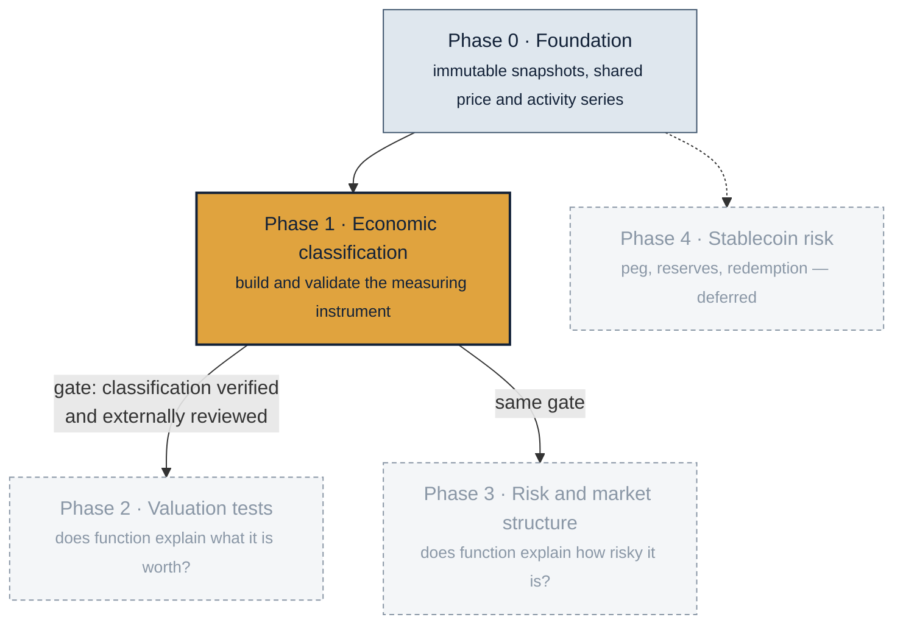
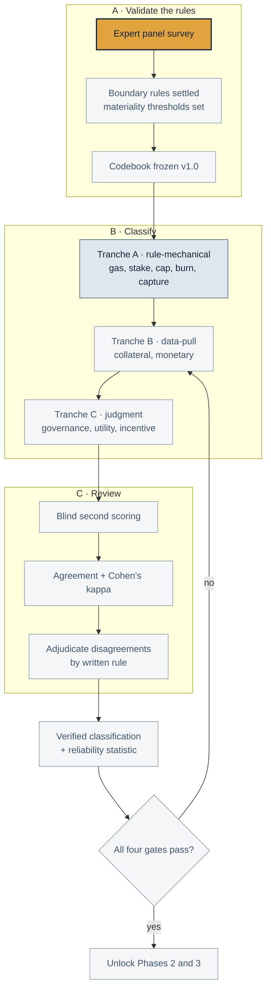

# Project plan

How this research is broken into phases, what each one delivers, and what has to be true before the next one starts. Updated 14 September 2026.

**Current focus: Phase 1 only.** Phases 2 and 3 have exploratory results already, but they are on hold until the classification they depend on is finished and validated. Phase 4 is parked.

---

## The programme at a glance



| Phase | Question it answers | Status | Data |
|---|---|---|---|
| 0 · Foundation | What can we measure, from sources that never change under us? | Complete and stable | `data/processed/00_foundation/` |
| **1 · Economic classification** | **What economic job does each token do, provably, on each date?** | **Active** | `data/processed/01_classification/` |
| 2 · Valuation tests | Does economic function explain market value? | Exploratory results, on hold | `data/processed/02_valuation/` |
| 3 · Risk and market structure | Does economic function explain risk exposure? | Exploratory results, on hold | `data/processed/03_risk/` |
| 4 · Stablecoin risk | What drives depegs and redemption failure? | Deferred | `data/processed/04_stablecoin_deferred/` |

**Why Phase 1 gates the rest.** Phases 2 and 3 both take the classification as an input variable. Every result they have produced so far is only as good as that input, and right now 119 of 250 classification cells are verified while the rest come from a provisional matrix that the first evidence tranche has already shown to be wrong in five places. Finishing and validating the instrument is not preparatory work; it is the work that makes everything downstream mean something.

---

## Phase 1 — Economic classification

**Deliverable.** A dataset that states, for all 25 assets across ten economic functions, whether the token performs that function, backed by a dated primary source, reconciled with an independent reviewer, with a published reliability statistic. Plus the codebook and adjudication rules that let someone else reproduce it.

**Done when.** All four gates pass:

| Gate | Test | Now |
|---|---|---|
| G1 Rules validated | Boundary rules confirmed by an external panel, not only internally adjudicated | Panel not yet run |
| G2 Coverage | Every asset in the working universe has all ten cells resolved, or explicitly null with a reason | 119 / 250 evidence-backed |
| G3 Reliability | Cohen's kappa reported against an external blind reviewer | κ = 1.00, but on **10 cells only** (5 assets, 2 codes). The six-asset core has never been independently reviewed. |
| G4 Consistency | Zero open consistency cases; every adjudicated rule applied everywhere it bites | 2 open cases |

### The Phase 1 workflow



### Where Phase 1 actually stands

**Done.** The ten-function codebook with written rules and evidence requirements. The effective-dating machinery, so a mechanism that switched on in December 2025 can never explain 2024 prices. Six core assets sourced at 60 of 60 cells against dated primary evidence. Tranche A drafted for 14 more assets: 59 of 70 sourced, 11 held pending. Two adjudicated rules on record, the governed-treasury capture boundary and the relay-policy fee boundary.

**Be precise about what "verified" means here.** 119 cells are *evidence-backed*, meaning a coder assigned a value from a dated primary source. Only **10** have been *independently blind-reviewed*, and those 10 are SOL, AVAX, TRX, XRP and ADA on burn and protocol capture. The published κ = 1.00 applies to that set and nothing else. The six-asset core is sourced, not reviewed. Gate G3 is therefore much further away than a headline count of 119 suggests, and closing it is the main thing the expert panel exists to do.

**Open.** No external reliability statistic for any cell outside those 10. 81 decisions to finish the 20 assets in the working universe: 11 tranche A adjudications, 28 tranche B, 42 tranche C. Two consistency cases. And the single most consequential unsettled item, what counts as *material monetary use* — the provisional matrix calls 14 of 20 assets money, which is too generous, and monetary use is the strongest predictor in every cross-sectional test run so far.

### Phase 1 step order

1. **Run the expert panel survey.** Settles the boundary rules and the materiality thresholds, and produces the external blind-scoring sample. Everything else waits on it, because the thresholds determine how tranche B is coded.
2. **Freeze the codebook at v1.0** with the panel's answers folded in, and record what changed and why.
3. **Tranche B**, collateral and monetary, under the newly settled thresholds.
4. **Tranche C**, governance, utility and incentive, with the heaviest blind review.
5. **Adjudicate** the 11 pending cells and the 2 open consistency cases.
6. **Report reliability** — agreement and kappa against the external reviewer.
7. **Gate review.** If all four gates pass, re-estimate Phases 2 and 3 on verified codes without touching their frozen specifications.

**Sequencing rule that must not be broken.** The survey is fielded and closed before any re-estimation. Several answers change classifications that determine the project's strongest association, so collecting them after seeing which answer helps would invalidate the result.

---

## Phase 2 — Valuation tests (on hold)

Does economic function explain market value? Four registered experiments have exploratory results: H1 usage, H2 fee-and-capture, H3 supply, H8 breadth and bundles, plus two mechanism event studies.

The headline so far is that the H2 fee-and-capture interaction is 0.132 with an exact p of 0.082 under a loose definition of capture, and 0.061 with p of 0.478 under the strict one. The result depends on a definition, which is exactly the definition Phase 1 is settling. Breadth commands no premium and mechanism activations are not visibly priced.

**Resumes when** Phase 1 gates pass. Then every experiment re-runs on verified codes with its specification unchanged.

## Phase 3 — Risk and market structure (on hold)

Does economic function explain risk rather than return? A 24-asset daily return panel from 2019 to 2026, a market-momentum-volatility factor baseline, and the frozen P1_H6 test of function against market beta, realized volatility and drawdown.

Current result: the direction is consistent and economically large, monetary assets averaging beta 0.93 and worst drawdown −1.44 against 1.19 and −2.37, but three of 27 tests reach p ≤ 0.05 against 1.35 expected by chance and none survives a 10 percent false-discovery rate. That test runs on provisional classifications, which is precisely why it cannot be reported as evidence yet.

**Resumes when** Phase 1 gates pass. The specification is already frozen and must not be revised; only the classification input changes.

## Phase 4 — Stablecoin risk (deferred)

Peg stability, reserve quality and redemption design, hypotheses H5 to H7. Scorecard, depeg episode panels and readiness audits are built and preserved. Not an active gate and not worked on until Phases 1 to 3 close.

---

## Reading the repository

| You want | Go to |
|---|---|
| What each data file is and who writes it | [`DATA_MAP.md`](DATA_MAP.md), generated by the pipeline |
| The research in plain language | [`research/findings/2026-09-07-research-program-explained.md`](research/findings/2026-09-07-research-program-explained.md) |
| The statistics and why each method was chosen | [`research/findings/2026-09-07-the-math-explained.md`](research/findings/2026-09-07-the-math-explained.md) |
| Every decision needing human judgment | [`research/open_decisions.md`](research/open_decisions.md) |
| The survey that unblocks Phase 1 | [`research/survey_instrument.md`](research/survey_instrument.md) |
| The paper | [`research/manuscript/main.tex`](research/manuscript/main.tex) |

```bash
python -m src.pipeline.run_stages --repo . --list      # the seven pipeline stages
python -m src.pipeline.run_stages --repo . --offline   # rebuild every processed artifact
python -m unittest discover -s tests                   # 242 tests
git status --short                                     # empty after a rebuild
```
