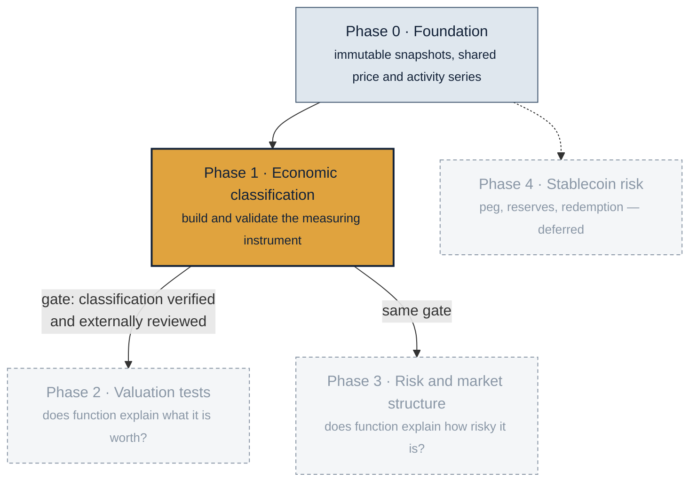
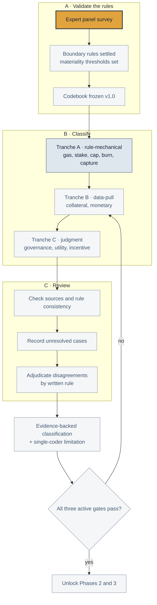

# Project plan

How this research is broken into phases, what each one delivers, and what has to be true before the next one starts. Updated 8 October 2026.

**Current focus: classification-to-valuation synthesis.** The 23-asset classification matrix is complete and H8 has been re-estimated on verified codes. Its temporal validation is frozen for 23 August 2026–22 August 2027 and cannot be estimated early. H3 now covers 16 material events across ARB and BNB; its two-asset result does not support the predicted direction and remains low-powered. External rule validation remains a limitation. H4 ETH data collection is the next blocked empirical build. Phase 4 is parked.

---

## The programme at a glance



| Phase | Question it answers | Status | Data |
|---|---|---|---|
| 0 · Foundation | What can we measure, from sources that never change under us? | Complete and stable | `data/processed/00_foundation/` |
| **1 · Economic classification** | **What economic job does each token do, provably, on each date?** | **23-asset matrix complete; external rule validation outstanding** | `data/processed/01_classification/` |
| **2 · Valuation tests** | **Does economic function explain market value?** | **H8 verified-universe extension complete; synthesis active** | `data/processed/02_valuation/` |
| 3 · Risk and market structure | Does economic function explain risk exposure? | Verified-input refresh complete; no result survives FDR correction | `data/processed/03_risk/` |
| 4 · Stablecoin risk | What drives depegs and redemption failure? | Deferred | `data/processed/04_stablecoin_deferred/` |

**Why Phase 1 gates the rest.** Phases 2 and 3 both take the classification as an input variable. The active 23-asset universe now has all 230 classification cells verified; DOGE and XMR are explicitly excluded. Freezing and propagating this instrument is what makes every downstream estimate interpretable.

---

## Phase 1 — Economic classification

**Deliverable.** A dataset that states, for all 25 assets across ten economic functions, whether the token performs that function, backed by a dated primary source. Plus the codebook and adjudication rules that would let someone else reproduce it. Reproducibility is *enabled*, not *demonstrated*: this is a single-coder project and no reliability statistic is claimed for the matrix.

**Done when.** All three active gates pass:

| Gate | Test | Now |
|---|---|---|
| G1 Rules validated | Boundary rules confirmed by an external panel, not only internally adjudicated | Panel not yet run |
| G2 Coverage | Every asset in the working universe has all ten cells resolved, or explicitly null with a reason | 230 / 230 evidence-backed |
| G3 Reliability | **Withdrawn as a gate.** One coder does the classification, so independent reproducibility is untested and is reported as a limitation. | κ = 1.00 exists for **10 cells only** (5 assets, 2 codes) from an earlier blind pass. It is not a reliability statistic for the matrix and is never cited as one. |
| G4 Consistency | Zero open consistency cases; every adjudicated rule applied everywhere it bites | 1 open case |

### The Phase 1 workflow



### Where Phase 1 actually stands

**Done.** The ten-function codebook with written rules and evidence requirements. The effective-dating machinery, so a mechanism that switched on in December 2025 can never explain 2024 prices. Six core assets sourced at 60 of 60 cells against dated primary evidence. Tranche A drafted for 14 more assets: 68 of 70 sourced, 2 held pending. Two adjudicated rules on record, the governed-treasury capture boundary and the relay-policy fee boundary.

**Be precise about what "verified" means here.** All 230 active-universe cells are *evidence-backed*, meaning a coder assigned a value from dated evidence. Only **10** have been *independently blind-reviewed*, and those 10 are SOL, AVAX, TRX, XRP and ADA on burn and protocol capture. The published κ = 1.00 applies to that set and nothing else. The six-asset core is sourced, not reviewed. Gate G3 has been withdrawn rather than left standing and unmet: with one coder, independent reproducibility cannot be demonstrated, so it is reported as a limitation instead of pursued as a gate.

**Open.** No external reliability statistic exists for any cell outside those 10. Coverage is complete; the remaining limitation is independent reproducibility, not missing classifications.

### Classification matrix

Snapshot: **8 October 2026**. The active universe contains 23 assets across ten economic functions: **230 evidence-backed cells, zero pending and zero provisional.** DOGE and XMR remain excluded with reasons recorded in the scope configuration.

**Values:** 1 = Yes; 0 = No; — = unresolved (no value assigned).

**Evidence status:** Plain values are sourced; R marks the earlier independent review; P marks provisional assumptions. A provisional 1 or 0 is not an evidence-backed classification. Unresolved cells show —.

| Asset | Monetary | Fee | Stake | Burn | Scarcity | Collateral | Governance | Capture | Utility | Incentive |
|---|---:|---:|---:|---:|---:|---:|---:|---:|---:|---:|
| BTC | 1 | 0 | 0 | 0 | 1 | 1 | 0 | 0 | 0 | 0 |
| ETH | 1 | 1 | 1 | 1 | 0 | 1 | 0 | 1 | 1 | 0 |
| BNB | 1 | 1 | 1 | 1 | 0 | 1 | 1 | 1 | 1 | 1 |
| XRP | 1 P | 1 | 0 | 1 R | 1 | 0 P | 0 | 1 R | 1 | — |
| SOL | 0 P | 1 | 1 | 1 R | 0 | 1 P | 0 | 1 R | 1 | — |
| TRX | 1 P | 1 | 1 | 1 R | 0 | 1 P | 1 | 1 R | 1 | — |
| HYPE | 0 | 1 | 1 | 1 | 1 | 0 | 1 | 1 | 1 | 1 |
| DOGE | 1 P | 0 | 0 | 0 | 0 | 0 P | 0 | 0 | 0 | — |
| ZEC | 1 P | 0 | 0 | 0 | 1 | 0 P | 1 | 0 | 0 | — |
| LINK | 0 P | 0 | 1 | 0 | 1 | 0 P | — | — | 1 | 1 |
| ADA | 0 P | 1 | 1 | 0 R | 1 | 1 P | 1 | 0 R | 1 | — |
| XMR | — | — | 0 | 0 | 0 | — | 0 | 0 | 0 | 0 |
| XLM | 1 P | 1 | 0 | 0 | 1 | 0 P | 0 | 0 | 1 | — |
| BCH | 1 P | 0 | 0 | 0 | 1 | 0 P | 0 | 0 | — | — |
| LTC | 1 P | 0 | 0 | 0 | 1 | 0 P | 0 | 0 | 0 | — |
| HBAR | 0 P | 1 | 1 | 0 | 1 | 0 P | 0 | 0 | 1 | — |
| SUI | 0 P | 1 | 1 | 0 | 1 | 1 P | — | 0 | 1 | — |
| AVAX | 0 P | 1 | 1 | 1 R | 1 | 1 P | 0 | 1 R | 1 | — |
| TON | — | 1 | 1 | 1 | 0 | — | 1 | 1 | 1 | — |
| TAO | — | 1 | — | — | 1 | — | — | — | 1 | — |
| UNI | 0 | 0 | 0 | 1 | 0 | 0 | 1 | 1 | 0 | 0 |
| AAVE | 0 | 0 | 1 | 0 | 0 | 1 | 1 | 0 | 0 | 1 |
| ARB | 0 | 0 | 0 | 0 | 0 | 0 | 1 | 0 | 0 | 1 |
| OP | 0 P | 0 | 0 | 0 | 0 | 0 P | 1 | — | 0 | — |
| POL | — | 1 | 1 | — | 0 | — | — | — | 1 | — |

Fee corresponds to `VA_GAS`; Capture corresponds to `VA_PROTOCOL` (protocol revenue capture). Other headings follow the codebook’s function names.

Source: the same classification records used by the [color-coded workbook](data/reference/digital_asset_research_universe.xlsx). This is a dated snapshot; refresh it when classification decisions change.

### Phase 1 step order

1. **Run the expert survey.** Collects external feedback on the boundary rules and the materiality thresholds. Tranche B waits on it, because the thresholds determine how those cells are coded. The survey is feedback on the rules, not a second coder.
2. **Freeze the codebook at v1.0** with the panel's answers folded in, and record what changed and why.
3. **Tranche B**, collateral and monetary, under the newly settled thresholds.
4. **Tranche C**, governance, utility and incentive, the most judgment-dependent cells.
5. **Resolve** the 40 pending cells: 2 in tranche A, 16 in tranche C and 22 in the five additional assets, including the existing open consistency cases.
6. **Report the limitation** — state plainly that one coder produced the matrix and that independent reproducibility is untested.
7. **Gate review.** If all three active gates pass, re-estimate Phases 2 and 3 on verified codes without touching their frozen specifications.

**Sequencing rule that must not be broken.** The survey is fielded and closed before any re-estimation. Several answers change classifications that determine the project's strongest association, so collecting them after seeing which answer helps would invalidate the result.

---

## Phase 2 — Valuation tests (active synthesis)

Does economic function explain market value? Four registered experiments have exploratory results: H1 usage, H2 fee-and-capture, H3 supply, H8 breadth and bundles, plus two mechanism event studies.

The H2 fee-and-capture interaction is 0.132 with an exact p of 0.082 under a loose definition of capture, and 0.061 with p of 0.478 under the strict one. The result is therefore definition-sensitive. The newer 23-asset H8 extension finds that financial integration modestly outpredicts raw function breadth; monetary/store use and supply absorption also survive 10% false-discovery control. These results remain exploratory and non-causal.

**Next checkpoint:** configure an archival ETH Beacon endpoint (BNB and legacy stkAAVE now have 365 days) and continue adding H3 assets from official exact-date events without selecting on returns. The H8 out-of-sample design is frozen; its 365-day window ends 22 August 2027 and requires at least 292 observations per asset before estimation.

## Phase 3 — Risk and market structure (exploratory refresh complete)

Does economic function explain risk rather than return? A 24-asset daily return panel from 2019 to 2026, a market-momentum-volatility factor baseline, and the frozen P1_H6 test of function against market beta, realized volatility and drawdown.

Current verified-input result: 19 assets meet the unchanged return-history rule. Monetary/store membership has the strongest association with shallower drawdowns (coefficient 1.071; permutation p = 0.0128), but only one of 27 tests reaches p ≤ 0.05 against 1.35 expected by chance, and none survives a 10 percent false-discovery rate. The classification limitation is removed; the analysis remains exploratory because the outcomes were already observed before this refresh.

**Next gate:** repeat the locked model on a genuinely later, non-overlapping risk window. Do not revise predictors or outcomes in response to the refresh result.

## Phase 4 — Stablecoin risk (deferred)

Peg stability, reserve quality and redemption design, hypotheses H5 to H7. Scorecard, depeg episode panels and readiness audits are built and preserved. Not an active gate and not worked on until Phases 1 to 3 close.

---

## Reading the repository

| You want | Go to |
|---|---|
| What each data file is and who writes it | [`DATA_MAP.md`](DATA_MAP.md), generated by the pipeline |
| The research in plain language | [`research/findings/2026-09-07-research-program-explained.md`](research/findings/2026-09-07-research-program-explained.md) |
| The statistics and why each method was chosen | [`research/findings/2026-09-07-the-math-explained.md`](research/findings/2026-09-07-the-math-explained.md) |
| Every decision needing human judgment | [`research/open_decisions.md`](research/open_decisions.md) |
| The survey that unblocks Phase 1 | [`research/survey_instrument.md`](research/survey_instrument.md) |
| The paper | [`research/manuscript/main.tex`](research/manuscript/main.tex) |

```bash
python -m src.pipeline.run_stages --repo . --list      # the seven pipeline stages
python -m src.pipeline.run_stages --repo . --offline   # rebuild every processed artifact
python -m unittest discover -s tests                   # 242 tests
git status --short                                     # empty after a rebuild
```

### September 14 source-review update

At the researcher’s request, governance, utility and incentive documentation was reviewed while survey responses are pending. Tranche C now has 26 sourced decisions and 16 explicit evidence gaps. This changes the working matrix only; the original estimates and specifications remain unchanged.

The five previously untouched registry assets now have all 50 cells inspected: 28 supported and 22 pending. Overall coverage is 182 supported, 40 pending and 28 provisional. The remaining provisional cells are monetary use and collateral in the original fourteen expansion assets.

The [September 14 expansion input build](research/findings/2026-09-14-expansion-input-build.md) closes the four fee decisions and archives the first activity histories for tranche B. No monetary or collateral codes are assigned by that build.

The [collateral collection follow-up](research/findings/2026-09-14-collateral-collection.md) adds balance candidates for nine assets, current Venus eligibility, and separate Avalanche activity series. Historical eligibility remains unresolved; matrix counts are unchanged.
