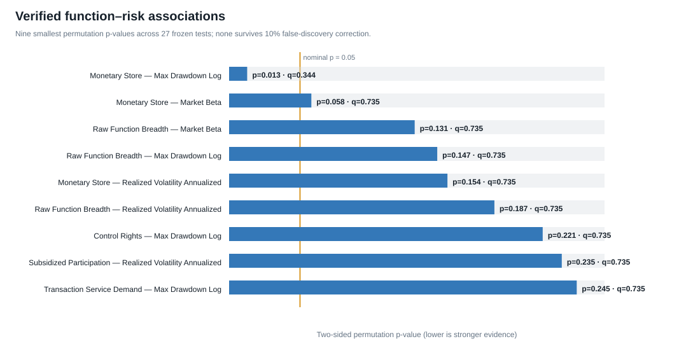

# Verified economic-function and risk refresh

The original frozen risk design has been re-estimated using the completed classification matrix. Only the classification input and obsolete sample label changed; the window, outcomes, predictors, liquidity control, permutation inference, and multiple-testing correction remain unchanged.

- Classification profiles checked: 23.
- Assets meeting the original return-history rule: 19.
- Frozen tests estimated: 27.
- Nominal p-values at or below 0.05: 1 (1.35 expected by chance).
- Tests surviving 10% false-discovery correction: 0.
- Strongest association: bundle_monetary_store with max_drawdown_log; coefficient 1.0708, permutation p=0.0127, q=0.3443.

Interpretation: monetary/store assets have shallower drawdowns and lower beta in this sample, but the 27-test family provides no false-discovery-controlled evidence that economic-function groups explain risk. This is an exploratory association, not a causal result or return forecast.

