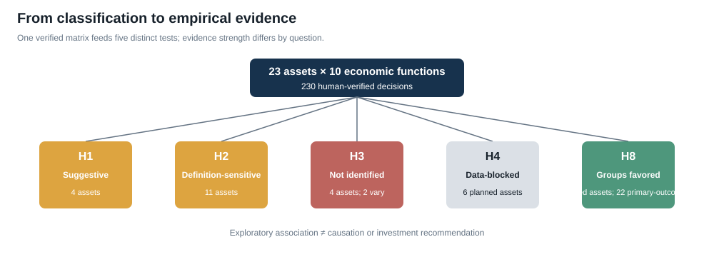
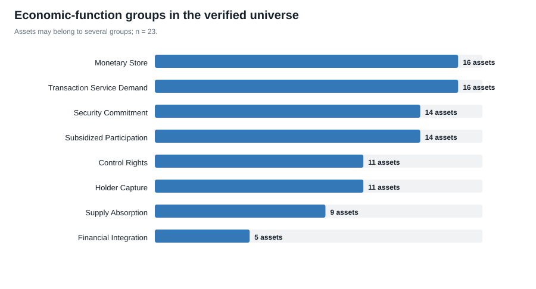
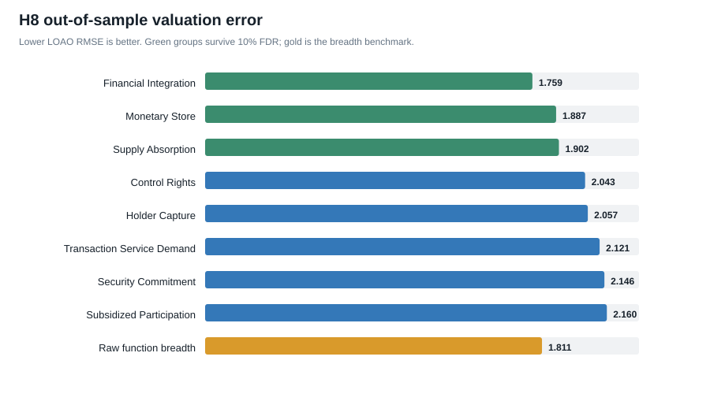
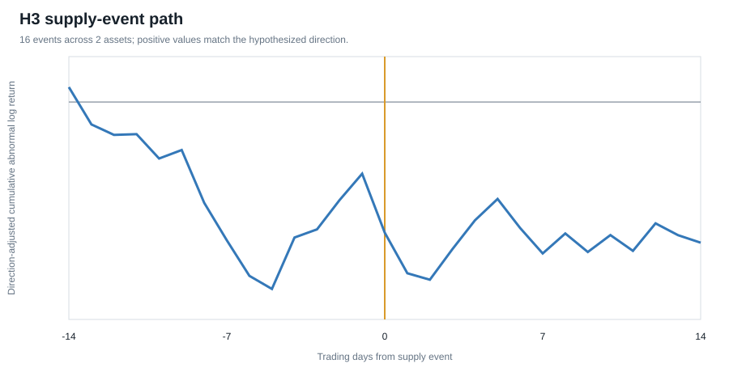
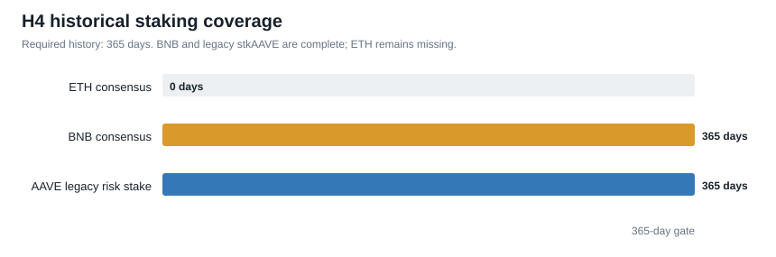

# Crypto economic-function analysis — visual summary

Green H8 bars identify groups that survive the pre-specified 10% false-discovery threshold. Lower prediction error is better. The H3 path is descriptive because every qualifying event belongs to ARB. For H4, BNB has a complete 365-day consensus-stake history and legacy stkAAVE is complete as a separate case study; ETH remains the blocker for pooled estimation. The verified risk refresh has one nominal p-value below 0.05 and none surviving 10% false-discovery correction. These are exploratory associations, not causal estimates.
